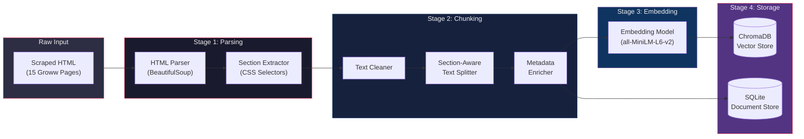
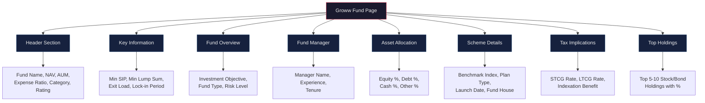
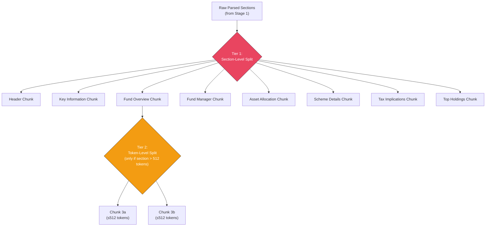
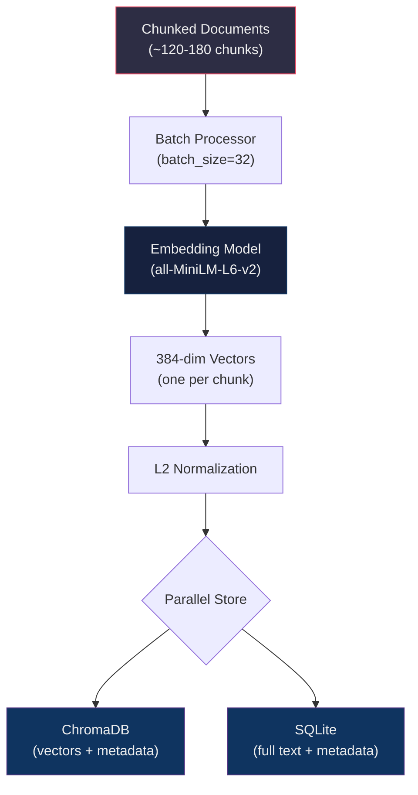
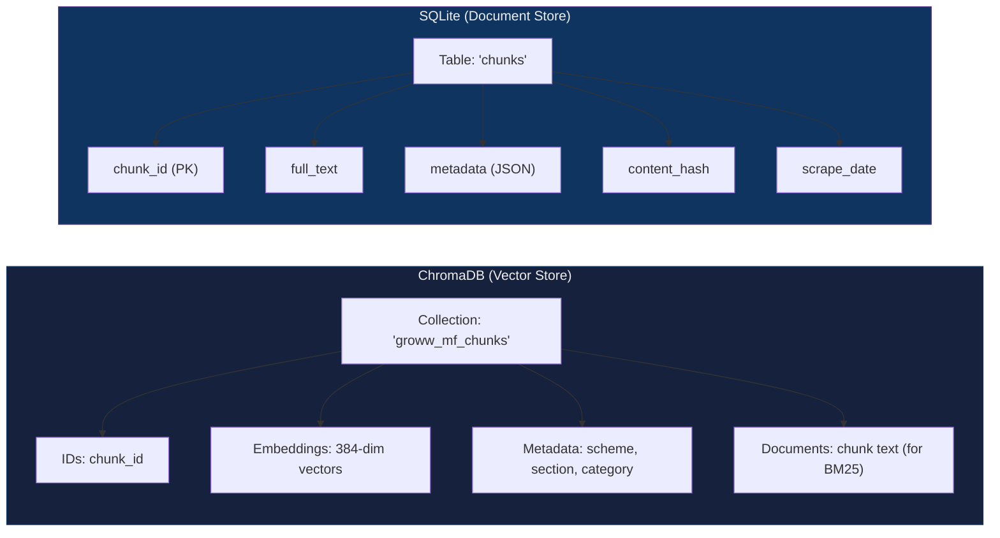
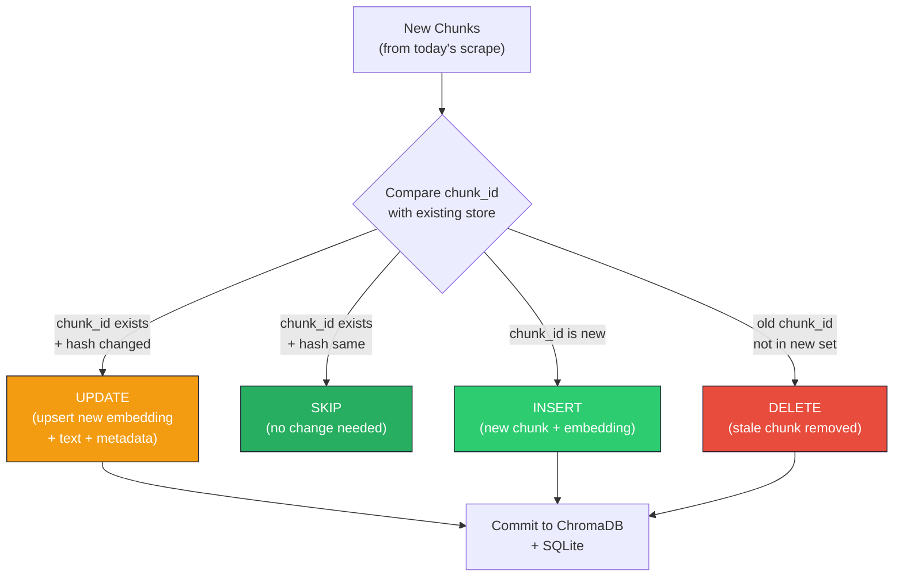

# Chunking & Embedding Architecture — Mutual Fund FAQ Assistant

> **Project**: Facts-Only Mutual Fund FAQ Chatbot (Groww Context)
> **Date**: 2026-04-13
> **Parent Document**: [RAGArchitecture.md](file:///c:/Users/yadav/OneDrive/Documents/Rag%20Chatbot/Docs/RAGArchitecture.md)

---

## 1. Overview

This document details the **Chunking and Embedding pipeline** — the process of transforming raw scraped HTML from 15 Groww mutual fund pages into semantically searchable vector embeddings stored in ChromaDB.



---

## 2. Stage 1 — HTML Parsing & Section Extraction

### 2.1 Problem

Each Groww mutual fund page is a React-rendered SPA containing multiple data sections (fund overview, key info, scheme details, etc.). We need to extract **structured, section-level text** rather than one flat blob of text.

### 2.2 Section Map

Each Groww page is broken into the following logical sections. The parser extracts each independently:



### 2.3 Section Extraction Strategy

Each section is extracted using targeted CSS selectors or heuristic patterns:

| Section | Extraction Method | Expected Output |
|---------|------------------|-----------------|
| **Header** | Target the fund title, NAV display, and AUM badge elements | `"HDFC Mid-Cap Fund Direct Growth, NAV: ₹523.45, AUM: ₹45,230 Cr, Expense Ratio: 0.75%"` |
| **Key Information** | Parse the key-value table/grid with SIP, lump sum, exit load, lock-in | Key-value pairs as structured text |
| **Fund Overview** | Extract the description paragraph and risk-o-meter value | Paragraph text + risk classification |
| **Fund Manager** | Extract manager name, experience years, and appointment date | Structured manager profile |
| **Asset Allocation** | Parse the allocation breakdown (equity/debt/cash percentages) | Tabular allocation data |
| **Scheme Details** | Extract benchmark, plan type, launch date from the details grid | Key-value pairs |
| **Tax Implications** | Parse STCG/LTCG rates and any special tax notes | Tax rate table as text |
| **Top Holdings** | Extract top stock/bond holdings with their portfolio percentage | List of holdings |

### 2.4 Parser Implementation

```python
from bs4 import BeautifulSoup
from dataclasses import dataclass

@dataclass
class ParsedSection:
    section_name: str        # e.g., "key_information"
    raw_text: str            # Cleaned text content
    data_points: list[str]   # Specific data fields found (e.g., ["exit_load", "min_sip"])
    source_url: str
    scheme_name: str

def parse_groww_page(html: str, url: str) -> list[ParsedSection]:
    soup = BeautifulSoup(html, 'html.parser')
    sections = []

    # Example: Extract Key Information section
    key_info_div = soup.select_one('div[class*="keyInfo"], div[class*="key-info"]')
    if key_info_div:
        sections.append(ParsedSection(
            section_name="key_information",
            raw_text=clean_text(key_info_div.get_text(separator="\n")),
            data_points=["min_sip", "min_lumpsum", "exit_load", "lock_in"],
            source_url=url,
            scheme_name=extract_scheme_name(soup)
        ))

    # ... similar extraction for each section
    return sections
```

> [!IMPORTANT]
> CSS selectors are **fragile** — Groww may update their class names or DOM structure at any time. The parser should:
> 1. Use multiple fallback selectors per section
> 2. Log warnings when a section cannot be found
> 3. Never fail silently — missing sections should be reported in `scrape_log.json`

---

## 3. Stage 2 — Chunking

### 3.1 Chunking Philosophy

The chunking strategy uses a **two-tier approach**:



**Tier 1 — Section-Level Splitting (Primary)**
- Each Groww page section becomes its own chunk
- Most sections are naturally small (< 512 tokens) so they remain as single chunks
- This preserves **semantic coherence** — all info about exit load stays together

**Tier 2 — Token-Level Splitting (Fallback)**
- Only applied when a section exceeds 512 tokens (e.g., a long fund overview or extensive holdings list)
- Uses `RecursiveCharacterTextSplitter` with overlap to split large sections

### 3.2 Chunking Configuration

| Parameter | Value | Rationale |
|-----------|-------|-----------|
| **Primary Split** | By Groww page section | Each section is a semantically coherent unit |
| **Max Chunk Size** | 512 tokens | Balance between retrieval precision and context retention |
| **Chunk Overlap** | 64 tokens | Prevents information loss at token-level split boundaries |
| **Separators** | `["\n\n", "\n", ". ", " "]` | Prioritizes natural breakpoints for Tier 2 splits |
| **Token Counter** | `tiktoken` with `cl100k_base` encoding | Accurate token counting for OpenAI-compatible models |
| **Minimum Chunk Size** | 50 tokens | Prevents tiny, useless chunks from being stored |

### 3.3 Chunking Implementation

```python
from langchain.text_splitter import RecursiveCharacterTextSplitter
import tiktoken

# Token-accurate text splitter
tokenizer = tiktoken.get_encoding("cl100k_base")

splitter = RecursiveCharacterTextSplitter(
    chunk_size=512,
    chunk_overlap=64,
    length_function=lambda text: len(tokenizer.encode(text)),
    separators=["\n\n", "\n", ". ", " "],
)

def chunk_sections(sections: list[ParsedSection]) -> list[dict]:
    """
    Two-tier chunking:
    Tier 1: Each section is a chunk (if ≤ 512 tokens)
    Tier 2: Split large sections into sub-chunks
    """
    chunks = []
    
    for section in sections:
        token_count = len(tokenizer.encode(section.raw_text))
        
        if token_count <= 512:
            # Tier 1: Section fits in one chunk
            chunks.append({
                "text": section.raw_text,
                "metadata": build_metadata(section, chunk_index=0, total_chunks=1)
            })
        else:
            # Tier 2: Section too large — split with overlap
            sub_texts = splitter.split_text(section.raw_text)
            for i, sub_text in enumerate(sub_texts):
                if len(tokenizer.encode(sub_text)) >= 50:  # Skip tiny chunks
                    chunks.append({
                        "text": sub_text,
                        "metadata": build_metadata(section, chunk_index=i, total_chunks=len(sub_texts))
                    })
    
    return chunks
```

### 3.4 Expected Chunk Distribution

Based on typical Groww page structure:

| Section | Avg Token Count | Chunks per Section | Notes |
|---------|---------------:|-------------------:|-------|
| Header | ~80 | 1 | Always fits in one chunk |
| Key Information | ~120 | 1 | Key-value pairs, compact |
| Fund Overview | ~200–600 | 1–2 | May need Tier 2 split if description is long |
| Fund Manager | ~60 | 1 | Short profile |
| Asset Allocation | ~100 | 1 | Percentage breakdown |
| Scheme Details | ~150 | 1 | Key-value pairs |
| Tax Implications | ~80 | 1 | STCG/LTCG rates |
| Top Holdings | ~200–800 | 1–2 | May need Tier 2 split if many holdings listed |
| **Total per page** | **~800–2000** | **~8–12** | |
| **Total (15 pages)** | | **~120–180 chunks** | |

### 3.5 Chunk Quality Guardrails

| Check | Rule | Action |
|-------|------|--------|
| **Minimum length** | Chunk must have ≥ 50 tokens | Discard if too small |
| **Maximum length** | Chunk must have ≤ 512 tokens | Split further if exceeded |
| **No empty chunks** | Text must be non-whitespace after cleaning | Skip empty sections |
| **Scheme name present** | Metadata must include scheme name | Reject chunk if scheme unknown |
| **Source URL present** | Metadata must include Groww URL | Reject chunk if source unknown |

---

## 4. Metadata Enrichment

### 4.1 Metadata Schema

Every chunk carries rich metadata that enables **filtered retrieval** and **source attribution**:

```json
{
  "chunk_id": "hdfc-mid-cap-key-information-0",
  "scheme_name": "HDFC Mid-Cap Fund",
  "scheme_slug": "hdfc-mid-cap-fund-direct-growth",
  "amc": "HDFC Mutual Fund",
  "category": "mid-cap",
  "doc_type": "groww_page",
  "section": "key_information",
  "source_url": "https://groww.in/mutual-funds/hdfc-mid-cap-fund-direct-growth",
  "scrape_date": "2026-04-13",
  "chunk_index": 0,
  "total_chunks": 1,
  "token_count": 118,
  "data_points": ["exit_load", "min_sip", "min_lumpsum", "lock_in_period"],
  "content_hash": "sha256:a3f2c8e1..."
}
```

### 4.2 Metadata Fields Explained

| Field | Type | Purpose |
|-------|------|---------|
| `chunk_id` | `str` | Unique identifier: `{scheme_slug}-{section}-{chunk_index}` |
| `scheme_name` | `str` | Human-readable fund name for display ​​in citations |
| `scheme_slug` | `str` | URL-safe identifier derived from the Groww URL |
| `amc` | `str` | Always `"HDFC Mutual Fund"` for current scope |
| `category` | `str` | Fund category: `mid-cap`, `large-cap`, `elss`, `index`, etc. |
| `doc_type` | `str` | Always `"groww_page"` for current scope |
| `section` | `str` | Which page section this chunk came from |
| `source_url` | `str` | Full Groww URL for citation in responses |
| `scrape_date` | `str` | ISO date of when data was scraped — used in response footer |
| `chunk_index` | `int` | Position within a multi-chunk section (0-based) |
| `total_chunks` | `int` | Total chunks from this section |
| `token_count` | `int` | Token count for context window management |
| `data_points` | `list[str]` | Specific data fields present in this chunk |
| `content_hash` | `str` | SHA-256 hash for change detection across scrape runs |

### 4.3 Category Mapping

The scheme category is derived from the URL slug and page content:

```python
CATEGORY_MAP = {
    "hdfc-mid-cap-fund": "mid-cap",
    "hdfc-equity-fund": "multi-cap",
    "hdfc-focused-fund": "focused",
    "hdfc-elss-tax-saver-fund": "elss",
    "hdfc-balanced-advantage-fund": "balanced-advantage",
    "hdfc-large-cap-fund": "large-cap",
    "hdfc-i-come-plus-arbitrage-active-fof": "fof-arbitrage",
    "hdfc-infrastructure-fund": "sectoral-thematic",
    "hdfc-nifty-next-50-index-fund": "index",
    "hdfc-large-and-mid-cap-fund": "large-mid-cap",
    "hdfc-nifty-100-equal-weight-index-fund": "index",
    "hdfc-small-cap-fund": "small-cap",
    "hdfc-nifty50-equal-weight-index-fund": "index",
    "hdfc-multi-asset-active-fof": "fof-multi-asset",
    "hdfc-retirement-savings-fund-equity-plan": "retirement-equity",
}
```

---

## 5. Stage 3 — Embedding

### 5.1 Embedding Model Selection

| Criteria | `all-MiniLM-L6-v2` (Primary) | `text-embedding-3-small` (Alternative) |
|----------|------------------------------|---------------------------------------|
| **Provider** | HuggingFace / Sentence-Transformers | OpenAI API |
| **Dimensions** | 384 | 1536 |
| **Max Input Tokens** | 256 word pieces (~512 tokens) | 8191 tokens |
| **Cost** | Free (local inference) | $0.02 / 1M tokens |
| **Latency** | ~5ms per chunk (CPU) | ~50ms per chunk (API call) |
| **Quality** | Good for short, factual text | Better semantic understanding |
| **Offline** | ✅ Yes | ❌ Requires internet |
| **Privacy** | ✅ No data leaves machine | ⚠️ Data sent to OpenAI |

> [!TIP]
> **Recommended**: Start with `all-MiniLM-L6-v2` for development (free, fast, offline). Evaluate `text-embedding-3-small` if retrieval quality needs improvement.

### 5.2 Embedding Generation Flow



### 5.3 Embedding Implementation

```python
from sentence_transformers import SentenceTransformer
import numpy as np

class EmbeddingService:
    def __init__(self, model_name: str = "sentence-transformers/all-MiniLM-L6-v2"):
        self.model = SentenceTransformer(model_name)
        self.dimension = self.model.get_sentence_embedding_dimension()  # 384
    
    def embed_chunks(self, chunks: list[dict], batch_size: int = 32) -> list[dict]:
        """
        Generate embeddings for all chunks in batches.
        Returns chunks with their embedding vectors attached.
        """
        texts = [chunk["text"] for chunk in chunks]
        
        # Batch encode for efficiency
        embeddings = self.model.encode(
            texts,
            batch_size=batch_size,
            show_progress_bar=True,
            normalize_embeddings=True,  # L2 normalization for cosine similarity
            convert_to_numpy=True
        )
        
        # Attach embeddings to chunks
        for chunk, embedding in zip(chunks, embeddings):
            chunk["embedding"] = embedding.tolist()
        
        return chunks
    
    def embed_query(self, query: str) -> list[float]:
        """
        Embed a single user query for similarity search.
        """
        embedding = self.model.encode(
            query,
            normalize_embeddings=True,
            convert_to_numpy=True
        )
        return embedding.tolist()
```

### 5.4 Embedding Configuration

| Parameter | Value | Rationale |
|-----------|-------|-----------|
| **Batch Size** | 32 | Balances memory usage and throughput on CPU |
| **Normalization** | L2 (unit vectors) | Required for cosine similarity; `cos(a,b) = dot(a,b)` when normalized |
| **Device** | CPU (default) | Sufficient for ~180 chunks; GPU only needed at scale |
| **Encoding Precision** | float32 | Full precision; quantization not needed at this scale |
| **Cache Model** | Yes (first load downloads ~80MB) | Model cached in `~/.cache/torch/sentence_transformers/` |

### 5.5 Performance Estimates

| Metric | Value |
|--------|-------|
| **Total chunks** | ~120–180 |
| **Embedding time (CPU)** | ~2–5 seconds for full corpus |
| **Embedding time (GPU)** | < 1 second |
| **Model memory** | ~80 MB |
| **Vector storage** | ~180 chunks × 384 dims × 4 bytes ≈ **0.27 MB** |

---

## 6. Stage 4 — Vector & Document Storage

### 6.1 Dual-Store Architecture

The system uses two complementary stores:



| Store | Purpose | What It Stores |
|-------|---------|---------------|
| **ChromaDB** | Semantic similarity search | Vectors + metadata + document text |
| **SQLite** | Full-text storage, BM25 search, audit trail | Complete chunk text + all metadata + content hashes |

### 6.2 ChromaDB Collection Design

```python
import chromadb

def initialize_vector_store(persist_dir: str = "data/vectorstore"):
    client = chromadb.PersistentClient(path=persist_dir)
    
    collection = client.get_or_create_collection(
        name="groww_mf_chunks",
        metadata={
            "hnsw:space": "cosine",        # Cosine similarity metric
            "hnsw:M": 16,                   # HNSW graph connectivity
            "hnsw:ef_construction": 100,    # Index build quality
        }
    )
    return collection

def upsert_chunks(collection, chunks: list[dict]):
    """
    Upsert chunks into ChromaDB.
    Uses upsert to handle both new and updated chunks.
    """
    collection.upsert(
        ids=[c["metadata"]["chunk_id"] for c in chunks],
        embeddings=[c["embedding"] for c in chunks],
        documents=[c["text"] for c in chunks],
        metadatas=[c["metadata"] for c in chunks],
    )
```

### 6.3 ChromaDB Configuration

| Parameter | Value | Rationale |
|-----------|-------|-----------|
| **Distance Metric** | `cosine` | Standard for normalized text embeddings |
| **HNSW M** | 16 | Good balance of search quality and index size for small corpus |
| **HNSW ef_construction** | 100 | High build quality (only ~180 vectors, so build time is negligible) |
| **HNSW ef_search** | 50 (default) | Query-time search quality |
| **Persistence** | `data/vectorstore/` directory | Survives app restarts; committed to git by GitHub Actions |

### 6.4 SQLite Schema

```sql
CREATE TABLE IF NOT EXISTS chunks (
    chunk_id       TEXT PRIMARY KEY,
    scheme_name    TEXT NOT NULL,
    scheme_slug    TEXT NOT NULL,
    amc            TEXT NOT NULL DEFAULT 'HDFC Mutual Fund',
    category       TEXT NOT NULL,
    section        TEXT NOT NULL,
    full_text      TEXT NOT NULL,
    source_url     TEXT NOT NULL,
    scrape_date    TEXT NOT NULL,
    token_count    INTEGER NOT NULL,
    content_hash   TEXT NOT NULL,
    metadata_json  TEXT NOT NULL,  -- Full metadata as JSON
    created_at     TIMESTAMP DEFAULT CURRENT_TIMESTAMP,
    updated_at     TIMESTAMP DEFAULT CURRENT_TIMESTAMP
);

CREATE INDEX idx_chunks_scheme ON chunks(scheme_slug);
CREATE INDEX idx_chunks_section ON chunks(section);
CREATE INDEX idx_chunks_category ON chunks(category);
```

### 6.5 Update Strategy (During Daily Refresh)

When the GitHub Actions workflow runs the daily scrape, the update follows this strategy:



| Scenario | Action | When It Happens |
|----------|--------|-----------------|
| **Chunk exists, content changed** | Upsert with new text, embedding, hash | Groww updated a data point (e.g., NAV, AUM) |
| **Chunk exists, content same** | Skip | No changes on that section of Groww page |
| **New chunk (new section appeared)** | Insert | Groww added a new section to the page |
| **Old chunk not in new scrape** | Delete | Groww removed a section from the page |

---

## 7. End-to-End Pipeline Example

**Input**: Freshly scraped HTML for `HDFC Mid-Cap Fund`

```
Step 1 │ Parse HTML           → 8 sections extracted (header, key_info, overview, ...)
Step 2 │ Clean Text           → Remove HTML artifacts, normalize whitespace
Step 3 │ Tier 1 Split         → 8 section-level chunks (all < 512 tokens)
       │                       → No Tier 2 splits needed for this page
Step 4 │ Metadata Enrich      → Each chunk tagged with scheme_name, section, source_url, ...
Step 5 │ Quality Check        → All 8 chunks pass minimum length (≥ 50 tokens)
Step 6 │ Embed                → 8 × 384-dim vectors generated (~40ms on CPU)
Step 7 │ Upsert to ChromaDB  → 8 vectors + metadata stored (or updated if content changed)
Step 8 │ Upsert to SQLite    → 8 rows with full text, metadata JSON, content hashes
Step 9 │ Log                  → "HDFC Mid-Cap Fund: 8 chunks, 3 updated, 5 unchanged"
```

**Result**: The fund's data is now searchable. A query like *"What is the exit load for HDFC Mid-Cap Fund?"* will retrieve the `key_information` chunk with high cosine similarity because it contains the exit load text.

---

## 8. File Structure

```
src/ingestion/
├── scraper.py                # Individual URL fetch + HTML download
├── scraping_service.py       # Orchestrates scraping all 15 URLs
├── parser.py                 # HTML → ParsedSection (BeautifulSoup extraction)
├── chunker.py                # Two-tier chunking + metadata enrichment
├── embedder.py               # Embedding generation + ChromaDB/SQLite storage
└── __init__.py

data/
├── urls.json                 # 15 Groww URLs
├── raw/                      # Raw HTML per scheme per date
├── processed/                # Intermediate processed chunks (optional debug)
├── vectorstore/              # ChromaDB persistence (committed to git)
└── chunks.db                 # SQLite database
```

---

## 9. Dependencies

```
# Parsing & Scraping
requests>=2.31.0
beautifulsoup4>=4.12.0
selenium>=4.15.0              # Fallback for JS-rendered pages

# Chunking
langchain-text-splitters>=0.0.1
tiktoken>=0.5.0               # Accurate token counting

# Embedding
sentence-transformers>=2.2.0
torch>=2.0.0                  # PyTorch backend for sentence-transformers

# Storage
chromadb>=0.4.0
sqlite3                       # Built-in Python stdlib

# Utilities
hashlib                       # Built-in (content hashing)
```

---

## 10. Monitoring & Observability

| Metric | How to Track | Alert Threshold |
|--------|-------------|-----------------|
| **Total chunks in store** | `collection.count()` | Alert if drops below 100 (data loss) |
| **Chunks updated per run** | Logged in `scrape_log.json` | Informational |
| **Embedding generation time** | Timed in pipeline | Alert if > 30 seconds |
| **Failed section extractions** | Parser warnings count | Alert if > 5 sections fail across all pages |
| **ChromaDB disk usage** | File size of `data/vectorstore/` | Alert if > 100MB (unexpected growth) |

---

> [!IMPORTANT]
> The chunking strategy is designed for **retrieval precision** — each chunk should ideally contain the answer to exactly one type of question. By splitting along Groww page sections, we ensure that a query about "exit load" retrieves the `key_information` chunk, not a mixed blob containing unrelated data about fund managers and asset allocation.
