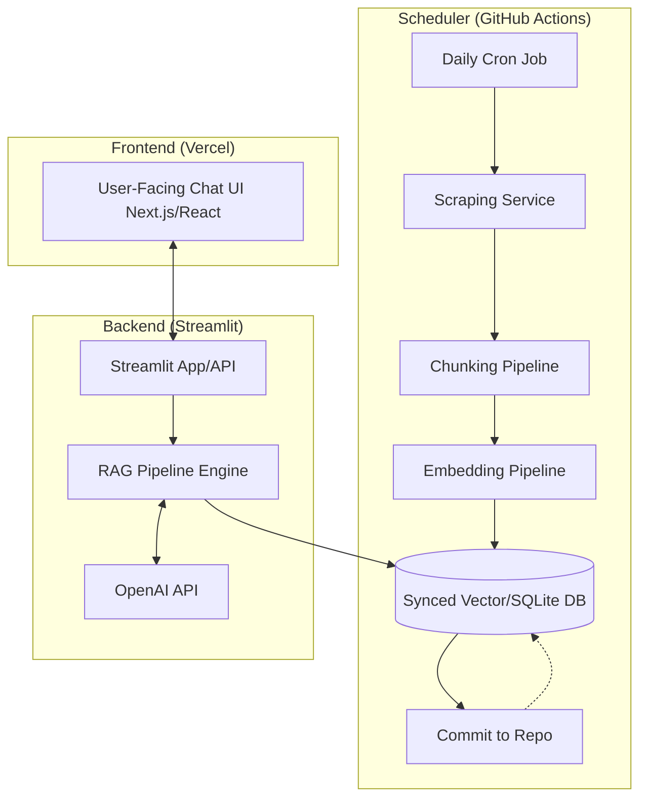

# Deployment Plan: Mutual Fund RAG Assistant

This document outlines the deployment strategy and architecture for the Mutual Fund RAG Chatbot, separating the application into three critical environments: Scheduler, Backend, and Frontend.

## 1. Architecture Overview

---

## 2. Component Strategies

### A. Scheduler (GitHub Actions)
**Purpose**: Automate the data ingestion pipeline to keep mutual fund facts up-to-date without manual intervention.

- **Platform**: GitHub Actions
- **Trigger**: Configured via `.github/workflows/daily-scrape.yml`. Runs on a schedule daily (e.g., 3:45 AM UTC).
- **Execution Flow**:
  1. Sets up the Python environment and headless browser/Selenium dependencies.
  2. Runs `src/ingestion/scraping_service.py` to identify updated Groww URLs.
  3. Triggers `src/ingestion/chunker.py` and `src/ingestion/embedder.py` to process new embeddings.
  4. Commits and pushes the updated `.db` SQLite files, ChromaDB directories, and JSON files back into the repository `data/` folder, making them available for the backend.

### B. Backend (Streamlit)
**Purpose**: Host the RAG pipeline logic, coordinate queries, provide an internal state view (Admin UI), and serve responses to the frontend.

- **Platform**: Streamlit Community Cloud (or a dedicated VPS hosting the Streamlit App).
- **Functionality**:
  - Houses `rag_pipeline.py`, which integrates the Retreiver, Reranker, prompt engineering, and LLM Generator.
  - While Streamlit natively is a monolithic GUI framework, for this architecture, it will serve as the **Backend Engine**. 
  - *Recommendation*: To easily connect the Vercel Frontend to this Streamlit Backend, consider spinning up a lightweight FastAPI endpoint alongside Streamlit, or deploy the Streamlit instance internally and wrap the RAG pipeline with FastAPI to serve JSON responses.
- **Data Source**: Pulls the most recently committed `data/` directory (ChromaDB + SQLite) from the GitHub repository automatically upon deployment.

### C. Frontend (Vercel)
**Purpose**: Deliver a premium, fast, edge-optimized user interface for the users.

- **Platform**: Vercel
- **Technology Stack**: Next.js, React, or pure Web components with modern sleek styling (Tailwind CSS, Framer Motion for micro-animations).
- **Functionality**:
  - Provides the sleek Chat Window, dynamic thinking states, and source-citation cards.
  - Entirely stateless. It sends user queries via HTTP POST to the backend API and renders the incoming responses.
- **Why Vercel?**: Provides out-of-the-box edge caching, global CDN, minimal latency, and native support for continuous deployment from a separate `frontend` branch or directory in GitHub.

---

## 3. CI/CD & Deployment Flow

1. **Continuous Data Updates**: 
   - GitHub Actions runs the cronjob.
   - Saves new embeddings and scraped data.
   - Autosyncs to GitHub.
2. **Backend Auto-Deployment**: 
   - Streamlit Cloud connects directly to the GitHub repo. 
   - Every time GitHub Actions pushes a new data commit to the `main` branch, Streamlit automatically detects the update, pulls the latest code/data, and reboots the app to serve fresh mutual fund information.
3. **Frontend Auto-Deployment**: 
   - Vercel watches for code changes in the frontend directory. When UI enhancements are pushed to the main branch, Vercel initiates a build process and deploys it live incrementally.

## 4. Next Steps for Implementation

- [ ] **Frontend Repository Setup**: Initialize a Next.js/Vite project in a `/frontend` directory or separate repository.
- [ ] **Backend API Wrapper**: Wrap `rag_pipeline.py` within an API (using FastAPI or Flask) so Vercel can securely fetch answers, since Streamlit GUI does not easily act as a REST provider.
- [ ] **Environment Secrets**: Add API Keys (e.g., OpenAI Key) securely to Vercel and Streamlit environment variables.
