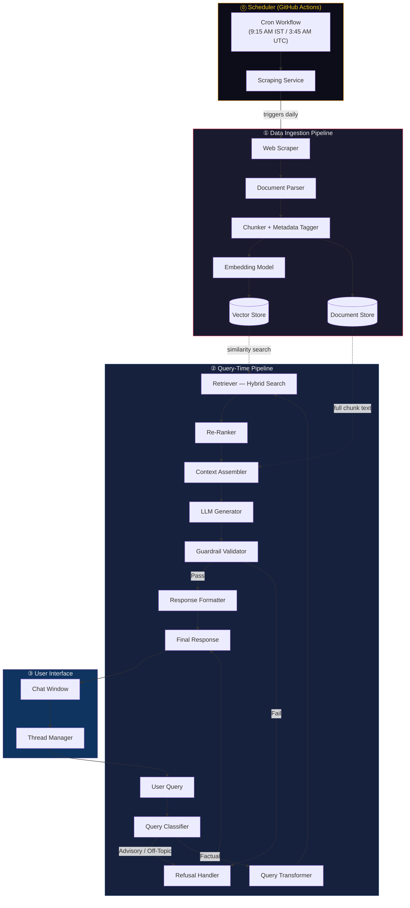
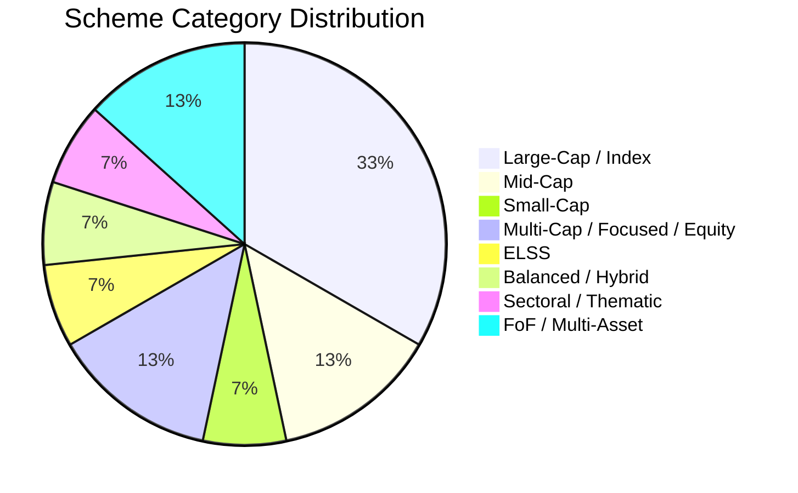
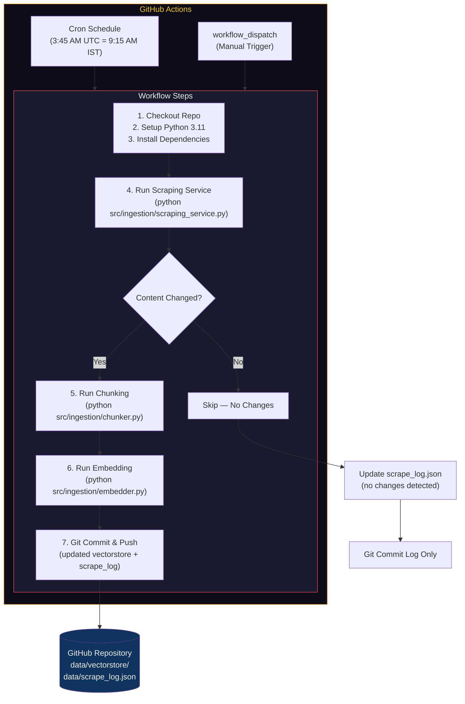
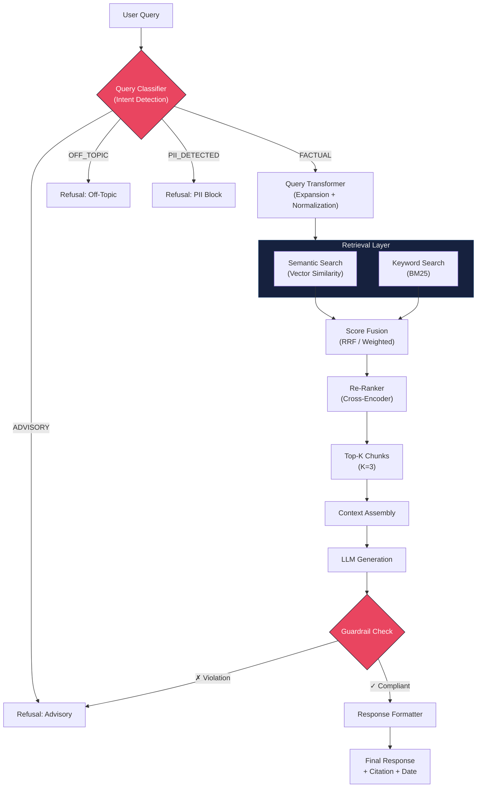
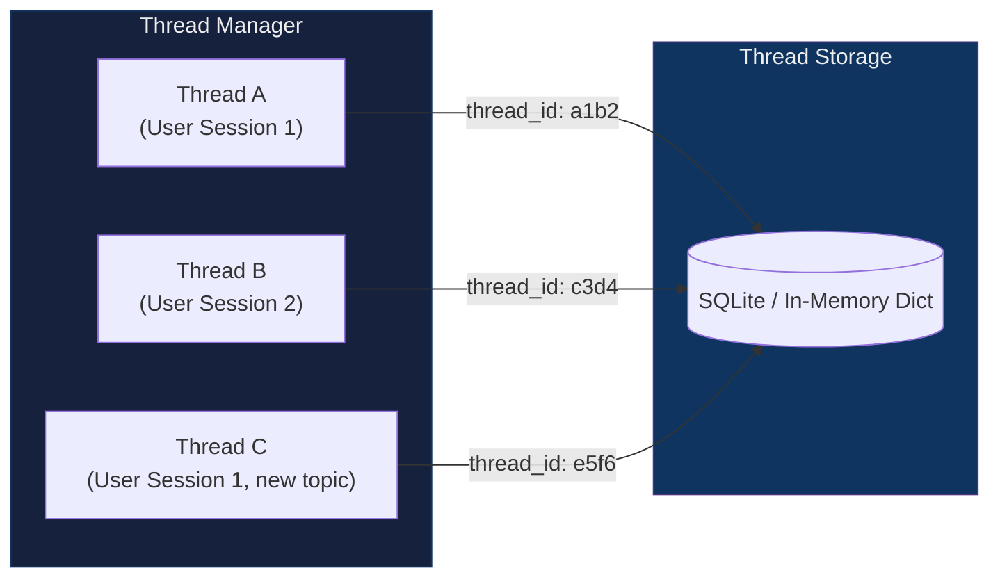
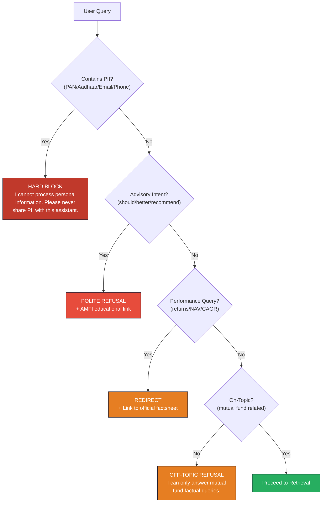

# RAG Architecture — Mutual Fund FAQ Assistant

> **Project**: Facts-Only Mutual Fund FAQ Chatbot (Groww Context)
> **Date**: 2026-04-13
> **Source**: [ProblemStatement.md](file:///c:/Users/yadav/OneDrive/Documents/Rag%20Chatbot/Docs/ProblemStatement.md)

---

## 1. High-Level Architecture



The architecture is divided into four major subsystems:

| # | Subsystem | Responsibility |
|---|-----------|---------------|
| ⓪ | **Scheduler (GitHub Actions)** | Cron-triggered workflow that runs daily at **9:15 AM IST** to scrape, chunk, embed, and commit updated data |
| ① | **Data Ingestion Pipeline** | Scrape, parse, chunk, embed, and store official mutual fund documents |
| ② | **Query-Time Pipeline** | Classify the query → retrieve relevant chunks → generate a compliant response |
| ③ | **User Interface** | Multi-thread chat UI with disclaimers and example questions |

---

## 2. Corpus Scope

The knowledge base is built exclusively from **15 HDFC Mutual Fund scheme pages on Groww**. No PDFs are used — all data is scraped from HTML pages.

### 2.1 Source URLs (15 Schemes)

| # | Scheme | Category | URL |
|---|--------|----------|-----|
| 1 | HDFC Mid-Cap Fund | Mid-Cap | [groww.in/…/hdfc-mid-cap-fund](https://groww.in/mutual-funds/hdfc-mid-cap-fund-direct-growth) |
| 2 | HDFC Equity Fund | Multi-Cap | [groww.in/…/hdfc-equity-fund](https://groww.in/mutual-funds/hdfc-equity-fund-direct-growth) |
| 3 | HDFC Focused Fund | Focused | [groww.in/…/hdfc-focused-fund](https://groww.in/mutual-funds/hdfc-focused-fund-direct-growth) |
| 4 | HDFC ELSS Tax Saver Fund | ELSS | [groww.in/…/hdfc-elss-tax-saver-fund](https://groww.in/mutual-funds/hdfc-elss-tax-saver-fund-direct-plan-growth) |
| 5 | HDFC Balanced Advantage Fund | Balanced Advantage | [groww.in/…/hdfc-balanced-advantage-fund](https://groww.in/mutual-funds/hdfc-balanced-advantage-fund-direct-growth) |
| 6 | HDFC Large Cap Fund | Large-Cap | [groww.in/…/hdfc-large-cap-fund](https://groww.in/mutual-funds/hdfc-large-cap-fund-direct-growth) |
| 7 | HDFC Income Plus Arbitrage Active FoF | FoF / Arbitrage | [groww.in/…/hdfc-i-come-plus-arbitrage](https://groww.in/mutual-funds/hdfc-i-come-plus-arbitrage-active-fof-direct-growth) |
| 8 | HDFC Infrastructure Fund | Sectoral / Thematic | [groww.in/…/hdfc-infrastructure-fund](https://groww.in/mutual-funds/hdfc-infrastructure-fund-direct-growth) |
| 9 | HDFC Nifty Next 50 Index Fund | Index / Large-Mid | [groww.in/…/hdfc-nifty-next-50-index-fund](https://groww.in/mutual-funds/hdfc-nifty-next-50-index-fund-direct-growth) |
| 10 | HDFC Large and Mid Cap Fund | Large & Mid Cap | [groww.in/…/hdfc-large-and-mid-cap-fund](https://groww.in/mutual-funds/hdfc-large-and-mid-cap-fund-direct-growth) |
| 11 | HDFC Nifty 100 Equal Weight Index Fund | Index | [groww.in/…/hdfc-nifty-100-equal-weight](https://groww.in/mutual-funds/hdfc-nifty-100-equal-weight-index-fund-direct-growth) |
| 12 | HDFC Small Cap Fund | Small-Cap | [groww.in/…/hdfc-small-cap-fund](https://groww.in/mutual-funds/hdfc-small-cap-fund-direct-growth) |
| 13 | HDFC Nifty 50 Equal Weight Index Fund | Index | [groww.in/…/hdfc-nifty50-equal-weight](https://groww.in/mutual-funds/hdfc-nifty50-equal-weight-index-fund-direct-growth) |
| 14 | HDFC Multi Asset Active FoF | FoF / Multi-Asset | [groww.in/…/hdfc-multi-asset-active-fof](https://groww.in/mutual-funds/hdfc-multi-asset-active-fof-direct-growth) |
| 15 | HDFC Retirement Savings Fund – Equity Plan | Retirement / Equity | [groww.in/…/hdfc-retirement-savings-fund](https://groww.in/mutual-funds/hdfc-retirement-savings-fund-equity-plan-direct-growth) |

### 2.2 Category Distribution



### 2.3 Data Available per Groww Page

Each Groww mutual fund page contains the following extractable data sections:

| Section | Factual Data Points |
|---------|--------------------|
| **Header** | Fund name, NAV, AUM, expense ratio, fund category |
| **Key Information** | Minimum SIP amount, minimum lump sum, lock-in period, exit load |
| **Fund Overview** | Investment objective, fund type, risk level (Riskometer) |
| **Fund Manager** | Name, experience, tenure |
| **Asset Allocation** | Equity/debt/cash split |
| **Scheme Details** | Benchmark index, plan type, launch date |
| **Tax Implications** | STCG/LTCG tax rates |

> [!NOTE]
> **No PDFs** (Factsheets, KIM, SID) are used in the current scope. All data comes from Groww HTML pages. PDF support can be added in a future iteration if AMC-hosted documents are needed.

---

## 3. Scheduler & Scraping Service

The scheduler uses **GitHub Actions** with a cron trigger to automatically re-scrape all 15 Groww URLs **every day at 9:15 AM IST (3:45 AM UTC)**.

### 3.1 Scheduler Design — GitHub Actions



### 3.2 GitHub Actions Workflow Configuration

**File**: `.github/workflows/daily-scrape.yml`

```yaml
name: Daily Groww Data Refresh

on:
  schedule:
    # 3:45 AM UTC = 9:15 AM IST
    - cron: '45 3 * * *'
  workflow_dispatch:  # Manual trigger from GitHub UI

jobs:
  scrape-and-ingest:
    runs-on: ubuntu-latest
    timeout-minutes: 15

    steps:
      - name: Checkout repository
        uses: actions/checkout@v4
        with:
          token: ${{ secrets.GITHUB_TOKEN }}

      - name: Setup Python 3.11
        uses: actions/setup-python@v5
        with:
          python-version: '3.11'
          cache: 'pip'

      - name: Install dependencies
        run: pip install -r requirements.txt

      - name: Install Chrome (for Selenium fallback)
        uses: browser-actions/setup-chrome@v1
        with:
          chrome-version: stable

      - name: Run scraping service
        run: python src/ingestion/scraping_service.py
        env:
          SCRAPE_MODE: full

      - name: Run chunking pipeline
        run: python src/ingestion/chunker.py

      - name: Run embedding pipeline
        run: python src/ingestion/embedder.py
        env:
          OPENAI_API_KEY: ${{ secrets.OPENAI_API_KEY }}

      - name: Commit updated data
        run: |
          git config user.name "github-actions[bot]"
          git config user.email "github-actions[bot]@users.noreply.github.com"
          git add data/
          git diff --staged --quiet || git commit -m "chore: daily data refresh $(date -u +%Y-%m-%d)"
          git push
```

### 3.3 Scheduler Configuration Summary

| Parameter | Value | Rationale |
|-----------|-------|-----------|  
| **Platform** | GitHub Actions | Free for public repos (2,000 min/month for private); no infra to manage |
| **Trigger** | `cron: '45 3 * * *'` | 3:45 AM UTC = 9:15 AM IST; runs after Indian market pre-open |
| **Manual Trigger** | `workflow_dispatch` | Allows on-demand re-scrape from GitHub UI |
| **Runner** | `ubuntu-latest` | Free, pre-configured with Python, Chrome, Git |
| **Timeout** | 15 minutes | Prevents runaway jobs; 15 URLs should complete well within this |
| **Secrets** | `OPENAI_API_KEY` | Stored in GitHub repo Settings → Secrets for embedding model (if using OpenAI) |
| **Concurrency** | Implicit (one workflow run at a time via cron) | Prevents overlapping scrapes |

> [!TIP]
> You can also trigger the workflow manually from the **GitHub Actions tab → "Daily Groww Data Refresh" → Run workflow** button.

> [!NOTE]
> GitHub Actions cron schedules can have up to ±15 minutes of delay. The job may not fire at exactly 3:45 UTC, but will run within a short window around that time.

### 3.3 Scraping Service — Detailed Flow

The scraping service is the core data collection engine that fetches and processes all 15 Groww URLs.

| Step | Action | Details |
|------|--------|---------|
| 1 | **Load URL List** | Read `data/urls.json` containing the 15 Groww scheme URLs |
| 2 | **Fetch Each URL** | Send HTTP GET via `requests` (with headers mimicking a browser User-Agent) |
| 3 | **JS Fallback** | If response is incomplete/empty, retry with `Selenium` headless Chrome |
| 4 | **Validate Response** | Check HTTP status = 200, content length > minimum threshold |
| 5 | **Parse HTML** | Extract structured sections using `BeautifulSoup` CSS selectors |
| 6 | **Diff Check** | Compare content hash against last scrape; skip if unchanged |
| 7 | **Save Raw HTML** | Write to `data/raw/<scheme-slug>_<date>.html` |
| 8 | **Trigger Ingestion** | Pass changed pages to the ingestion pipeline (chunk → embed → store) |
| 9 | **Log Results** | Write scrape report to `data/scrape_log.json` |

**Request Configuration**:

```python
HEADERS = {
    "User-Agent": "Mozilla/5.0 (Windows NT 10.0; Win64; x64) AppleWebKit/537.36 "
                  "(KHTML, like Gecko) Chrome/120.0.0.0 Safari/537.36",
    "Accept": "text/html,application/xhtml+xml,application/xml;q=0.9,*/*;q=0.8",
    "Accept-Language": "en-US,en;q=0.5",
}
TIMEOUT = 30  # seconds
RETRY_COUNT = 3
RETRY_DELAY = 30  # seconds between retries
```

### 3.4 Change Detection (Diff Check)

To avoid unnecessary re-processing, the scraping service compares each page against its previous version:

```python
import hashlib

def has_content_changed(new_content: str, scheme_slug: str) -> bool:
    new_hash = hashlib.sha256(new_content.encode()).hexdigest()
    previous_hash = load_previous_hash(scheme_slug)  # from scrape_log.json
    if new_hash != previous_hash:
        save_hash(scheme_slug, new_hash)
        return True
    return False
```

| Scenario | Action |
|----------|--------|
| Content **changed** | Save new HTML → re-chunk → re-embed → update vector store |
| Content **unchanged** | Skip ingestion; log as "no update" |
| Fetch **failed** | Log error with URL, status code, timestamp; keep previous data |

### 3.5 Scrape Log Format

After each run, a structured log is written to `data/scrape_log.json`:

```json
{
  "run_id": "2026-04-14T09:15:00+05:30",
  "triggered_by": "scheduler",
  "duration_seconds": 42,
  "results": [
    {
      "url": "https://groww.in/mutual-funds/hdfc-mid-cap-fund-direct-growth",
      "scheme": "HDFC Mid-Cap Fund",
      "status": "updated",
      "content_hash": "a3f2c8...",
      "scrape_time_ms": 1200
    },
    {
      "url": "https://groww.in/mutual-funds/hdfc-elss-tax-saver-fund-direct-plan-growth",
      "scheme": "HDFC ELSS Tax Saver Fund",
      "status": "unchanged",
      "content_hash": "b7d1e4...",
      "scrape_time_ms": 980
    },
    {
      "url": "https://groww.in/mutual-funds/hdfc-small-cap-fund-direct-growth",
      "scheme": "HDFC Small Cap Fund",
      "status": "failed",
      "error": "HTTP 503 Service Unavailable",
      "retry_count": 3
    }
  ],
  "summary": {
    "total": 15,
    "updated": 4,
    "unchanged": 10,
    "failed": 1
  }
}
```

### 3.6 Error Handling & Resilience

| Failure Scenario | Handling |
|-----------------|----------|
| **Single URL fails** | Retry 3× with 30s delay; if still failing, skip and keep previous data; log error |
| **All URLs fail** (network down) | Abort run; log critical error; keep entire previous knowledge base intact |
| **Groww rate-limits** (HTTP 429) | Exponential backoff: 30s → 60s → 120s; add random jitter |
| **Selenium crashes** | Catch exception; fall back to `requests`; log warning |
| **GitHub Actions cron delays** | Cron can drift ±15 min; acceptable for daily refresh |
| **Workflow fails mid-run** | No git commit made; previous data remains intact; GitHub sends failure notification |
| **Ingestion fails** mid-pipeline | Atomic updates — only commit vector store data after full success |

> [!IMPORTANT]
> The scraping pipeline uses **atomic commits**: the existing data in the repo remains untouched during the scrape. Only after all changed pages are successfully scraped, chunked, and embedded does a git commit push the new data. If the workflow fails at any step, **no partial data is committed** — the previous data remains intact.

---

## 4. Data Ingestion Pipeline (Offline)

This pipeline is **triggered by the GitHub Actions workflow** (either via daily cron at 9:15 AM IST, or manual `workflow_dispatch`). It processes only the **changed pages** detected by the diff check.

```mermaid
flowchart LR
    subgraph Trigger["Trigger (GitHub Actions)"]
        SCH["Cron Schedule\n(Daily 9:15 AM IST)"]
        MAN["workflow_dispatch\n(Manual Trigger)"]
    end

    subgraph Sources["Changed Pages Only"]
        URL1["Updated Groww HTML\n(from Scraping Service)"]
    end

    subgraph Parse["Document Processing"]
        SCRAPE["Web Scraper\n(requests + BeautifulSoup /\nSelenium for dynamic content)"]
        CLEAN["HTML Cleaner\n(strip nav, ads, scripts)"]
    end

    subgraph Chunk["Chunking & Enrichment"]
        SPLITTER["Recursive Text Splitter\n(chunk_size=512, overlap=64)"]
        META["Metadata Tagger\n(scheme, category,\nsource_url, scrape_date)"]
    end

    subgraph Store["Storage"]
        EMB["Embedding Model\n(all-MiniLM-L6-v2 /\ntext-embedding-3-small)"]
        VS[(ChromaDB / Qdrant\nVector Store)]
        DS[(SQLite\nDocument Store)]
    end

    SCH -->|triggers| Sources
    MAN -->|triggers| Sources
    Sources --> SCRAPE
    SCRAPE --> CLEAN
    CLEAN --> SPLITTER
    SPLITTER --> META
    META --> EMB --> VS
    META --> DS

    style Trigger fill:#0d0d1a,stroke:#f39c12,color:#f1c40f
    style Sources fill:#2d2d44,stroke:#e94560,color:#eee
    style Parse fill:#1a1a2e,stroke:#e94560,color:#eee
    style Chunk fill:#16213e,stroke:#0f3460,color:#eee
    style Store fill:#0f3460,stroke:#533483,color:#eee
```



### 3.1 Web Scraping & Document Collection

| Component | Details |
|-----------|---------|
| **Tool** | `requests` + `BeautifulSoup4` for static HTML; `Selenium` / `Playwright` as fallback for JS-rendered content |
| **Source URLs** | 15 Groww HDFC scheme pages (see §2.1 for full list) |
| **Document Types** | HTML pages only — no PDFs in current scope |
| **Output** | Raw text + metadata dict per page |

> [!IMPORTANT]
> Groww pages may use client-side rendering (React/Next.js). If `requests` returns incomplete content, use **Selenium with headless Chrome** or **Playwright** to render the page before scraping.

> [!NOTE]
> Only Groww (as the reference product context) is scraped. Third-party blogs and aggregators are **strictly excluded** per compliance constraints.

### 3.2 HTML Parsing & Cleaning

- **Navigation/Chrome**: Strip header, footer, sidebar, ads, and script tags
- **Section Extraction**: Target specific CSS selectors for each data section (fund overview, key info, scheme details)
- **Table Parsing**: Extract structured tables (asset allocation, tax info) into key-value pairs
- **Cleaning**: Normalize whitespace, remove boilerplate, fix encoding issues, strip cookie banners

### 3.3 Chunking Strategy

| Parameter | Value | Rationale |
|-----------|-------|-----------|
| **Method** | `RecursiveCharacterTextSplitter` | Respects paragraph/sentence boundaries |
| **Chunk Size** | 512 tokens | Small enough for precise retrieval; large enough to retain context |
| **Chunk Overlap** | 64 tokens | Prevents information loss at boundaries |
| **Separators** | `["\n\n", "\n", ". ", " "]` | Prioritizes natural breakpoints |
| **Section-Aware** | Split by Groww page sections first | Each section (Key Info, Fund Overview, etc.) becomes a logical chunk boundary |

### 3.4 Metadata Tagging

Every chunk is tagged with structured metadata for **filtered retrieval**:

```json
{
  "chunk_id": "hdfc-midcap-groww-chunk-003",
  "scheme_name": "HDFC Mid-Cap Fund",
  "amc": "HDFC Mutual Fund",
  "category": "mid-cap",
  "doc_type": "groww_page",
  "source_url": "https://groww.in/mutual-funds/hdfc-mid-cap-fund-direct-growth",
  "scrape_date": "2026-04-13",
  "section": "Key Information",
  "data_points": ["exit_load", "min_sip", "lock_in"]
}
```

### 3.5 Embedding & Storage

| Component | Primary Choice | Alternative |
|-----------|---------------|-------------|
| **Embedding Model** | `sentence-transformers/all-MiniLM-L6-v2` (384-dim, fast, free) | OpenAI `text-embedding-3-small` (1536-dim, paid) |
| **Vector Store** | **ChromaDB** (local, lightweight, zero-config) | **Qdrant** (production-grade, filtering support) |
| **Document Store** | **SQLite** (full chunk text, metadata, source URLs) | PostgreSQL for production |

> [!TIP]
> With 15 Groww pages, expect ~150–400 chunks total. ChromaDB handles this easily in-process with no external dependencies.

---

## 4. Query-Time Pipeline (Online)

This is the real-time flow triggered on every user message.



### 4.1 Query Classifier

The **first gate** in the pipeline. Classifies every incoming query before retrieval.

| Classification | Action | Example |
|---------------|--------|---------|
| `FACTUAL` | Proceed to retrieval | "What is the exit load of HDFC Mid-Cap Fund?" |
| `ADVISORY` | Refuse with polite message + AMFI/SEBI link | "Should I invest in this fund?" |
| `COMPARATIVE` | Refuse | "Which fund is better — HDFC or SBI?" |
| `PERFORMANCE` | Refuse + link to official factsheet | "What are the 3-year returns?" |
| `OFF_TOPIC` | Refuse | "What's the weather today?" |
| `PII_DETECTED` | Hard block | "My PAN is ABCPD1234E, check my..." |

**Implementation Strategy**:

```
Option A (Lightweight):  Rule-based classifier using keyword patterns + regex
                         ├── Advisory keywords: "should", "better", "recommend", "suggest"
                         ├── PII patterns: PAN regex, Aadhaar regex, email regex
                         └── Performance keywords: "returns", "NAV growth", "CAGR"

Option B (LLM-based):    Zero-shot classification via the same LLM with a system prompt
                         └── More flexible but adds latency + cost
                         
Recommended:             Hybrid — Rule-based for PII (hard block) + LLM for intent
```

### 4.2 Query Transformer

Before retrieval, the raw query is refined:

1. **Normalization**: Lowercase, expand abbreviations ("ER" → "expense ratio", "SIP" → "Systematic Investment Plan")
2. **Query Expansion**: If the query mentions a scheme name, append the AMC context
3. **Hypothetical Document Embedding (HyDE)** *(optional)*: Generate a hypothetical answer, embed it, and use for retrieval — improves semantic matching

### 4.3 Retrieval — Hybrid Search

Combines two complementary retrieval methods:

| Method | Mechanism | Strength |
|--------|-----------|----------|
| **Semantic Search** | Cosine similarity on embeddings in Vector Store | Captures meaning — "exit fee" matches "exit load" |
| **BM25 Keyword Search** | TF-IDF on raw text in Document Store | Exact term matching — "HDFC Mid-Cap" matches precisely |

**Score Fusion**: Reciprocal Rank Fusion (RRF) merges results from both methods:

```
RRF_score(doc) = Σ  1 / (k + rank_i(doc))    where k = 60
```

### 4.4 Re-Ranker

A lightweight **cross-encoder** re-ranks the top ~10 candidates to select the final **Top-3 chunks**.

| Component | Choice |
|-----------|--------|
| **Model** | `cross-encoder/ms-marco-MiniLM-L-6-v2` |
| **Input** | (query, chunk) pairs |
| **Output** | Relevance score per pair |

> [!NOTE]
> Re-ranking is optional for the initial version. It adds ~200ms latency but significantly improves precision, especially for ambiguous queries.

### 4.5 Context Assembly

The top-3 chunks are formatted into a structured context block for the LLM:

```
[SOURCE 1] (scheme: HDFC Mid-Cap | doc: Factsheet | url: https://...)
<chunk text>

[SOURCE 2] (scheme: HDFC Mid-Cap | doc: SID | url: https://...)
<chunk text>

[SOURCE 3] (scheme: HDFC Mid-Cap | doc: KIM | url: https://...)
<chunk text>
```

### 4.6 LLM Generation

| Parameter | Value |
|-----------|-------|
| **Model** | `gpt-4o-mini` (cost-effective) or `gpt-3.5-turbo` |
| **Temperature** | `0.0` (deterministic, factual) |
| **Max Tokens** | `200` (enforces brevity) |
| **System Prompt** | See §4 below |

### 4.7 Guardrail Validator (Post-Generation)

A final check on the LLM output before delivery:

| Check | Method | Action on Failure |
|-------|--------|-------------------|
| **Advisory language** | Keyword scan for "recommend", "should invest", "I suggest" | Replace with refusal |
| **Citation present** | Regex check for URL in output | Append source from metadata |
| **Length limit** | Sentence count ≤ 3 | Truncate or regenerate |
| **PII in response** | Regex scan | Strip and warn |
| **Hallucination check** | Verify key facts appear in retrieved chunks | Flag uncertain responses |

---

## 5. Prompt Engineering

### 5.1 System Prompt

```text
You are a facts-only mutual fund FAQ assistant. You answer using ONLY the provided 
context from official AMC, AMFI, and SEBI sources.

STRICT RULES:
1. Answer in a maximum of 3 sentences.
2. Include EXACTLY ONE source citation URL from the context.
3. End every response with: "Last updated from sources: <scrape_date>"
4. NEVER provide investment advice, opinions, or recommendations.
5. NEVER compare fund performance or calculate returns.
6. If the context does not contain the answer, say:
   "I don't have this information in my current sources. Please check [relevant official URL]."
7. NEVER ask for or acknowledge PAN, Aadhaar, account numbers, OTPs, emails, or phone numbers.
8. For performance-related queries, respond ONLY with a link to the official factsheet.

You are NOT a financial advisor. You are a factual information retrieval system.
```

### 5.2 User Prompt Template

```text
Context:
{assembled_context}

Question: {user_query}

Answer (max 3 sentences, 1 citation, include last updated date):
```

### 5.3 Refusal Prompt Template

```text
I can only provide factual information about mutual fund schemes, such as expense 
ratios, exit loads, SIP amounts, and lock-in periods. I'm unable to offer investment 
advice or recommendations.

For investment guidance, please visit: https://www.amfiindia.com/investor-corner

Last updated from sources: {scrape_date}
```

---

## 6. Multi-Thread Conversation Management

The system must support **multiple independent chat threads** simultaneously.



### Thread Data Model

```json
{
  "thread_id": "uuid-v4",
  "created_at": "2026-04-13T19:30:00Z",
  "title": "HDFC Mid-Cap Fund Questions",
  "messages": [
    {
      "role": "user",
      "content": "What is the exit load?",
      "timestamp": "2026-04-13T19:30:05Z"
    },
    {
      "role": "assistant",
      "content": "The exit load for HDFC Mid-Cap...",
      "citations": ["https://..."],
      "timestamp": "2026-04-13T19:30:07Z"
    }
  ]
}
```

### Design Decisions

| Decision | Choice | Rationale |
|----------|--------|-----------|
| **Thread isolation** | Each thread has its own message history | Prevents cross-contamination between topics |
| **Context window** | Last 3 messages from current thread only | Keeps LLM context small and focused |
| **Storage** | SQLite for persistence, in-memory cache for active threads | Balances speed and durability |
| **Thread creation** | Explicit "New Chat" button | Gives user control |

---

## 7. Refusal Handling — Detailed Flow



---

## 8. UI Layer

### 8.1 Interface Components

| Component | Description |
|-----------|-------------|
| **Welcome Banner** | Project name + disclaimer: *"Facts-only. No investment advice."* |
| **Example Questions** | 3 clickable example queries (e.g., "What is the expense ratio of HDFC Flexi-Cap Fund?") |
| **Chat Window** | Scrollable message area with user/assistant bubbles |
| **Input Bar** | Text input + send button |
| **Thread Sidebar** | List of past conversations with "New Chat" button |
| **Citation Badge** | Clickable source link rendered below each assistant message |
| **Date Footer** | "Last updated from sources: YYYY-MM-DD" on every response |

### 8.2 Tech Stack for UI

| Option | Stack | Best For |
|--------|-------|----------|
| **A — Minimal** | Streamlit | Rapid prototyping, single-file deployment |
| **B — Custom** | FastAPI (backend) + React/Next.js (frontend) | Production-grade, custom design |
| **C — Balanced** | FastAPI (backend) + Vanilla HTML/CSS/JS (frontend) | Lightweight, no framework overhead |

> [!TIP]
> **Recommended for this project**: Option A (Streamlit) for initial development, migrate to Option B for production if needed.

---

## 10. Technology Stack Summary

| Layer | Technology | Purpose |
|-------|-----------|---------|
| **Scheduler** | GitHub Actions (cron: `45 3 * * *`) | Daily 9:15 AM IST automated workflow |
| **Scraping** | `requests` + `BeautifulSoup4`, `Selenium` (fallback) | Groww HTML page scraping |
| **Chunking** | `langchain.text_splitter` | Recursive text splitting |
| **Embeddings** | `sentence-transformers/all-MiniLM-L6-v2` | Local, free embedding model |
| **Vector Store** | `ChromaDB` | Local vector database |
| **Keyword Search** | `rank_bm25` | BM25 sparse retrieval |
| **Re-Ranker** | `cross-encoder/ms-marco-MiniLM-L-6-v2` | Cross-encoder re-ranking |
| **LLM** | `gpt-4o-mini` via OpenAI API | Response generation |
| **Backend** | `FastAPI` or `Streamlit` | API / UI server |
| **Frontend** | `Streamlit` or `HTML/CSS/JS` | Chat interface |
| **Thread Storage** | `SQLite` | Conversation persistence |
| **Orchestration** | `LangChain` / custom Python | Pipeline orchestration |

---

## 11. Data Flow — End-to-End Example

**User asks**: *"What is the exit load for HDFC Mid-Cap Opportunities Fund?"*

```
Step 1 │ Query Classifier    → Classification: FACTUAL ✅
Step 2 │ Query Transformer   → Normalized: "exit load hdfc mid-cap opportunities fund"
Step 3 │ Semantic Search      → Top 5 chunks by embedding similarity
Step 4 │ BM25 Search          → Top 5 chunks by keyword relevance
Step 5 │ RRF Fusion           → Merged & deduplicated → Top 10 candidates
Step 6 │ Re-Ranker            → Cross-encoder scores → Top 3 chunks selected
Step 7 │ Context Assembly     → 3 chunks + metadata formatted for LLM
Step 8 │ LLM Generation       → "The exit load for HDFC Mid-Cap Fund is 1% if
       │                         redeemed within 1 year from the date of allotment,
       │                         and nil thereafter.
       │                         Source: https://groww.in/mutual-funds/hdfc-mid-cap-fund-direct-growth
       │                         Last updated from sources: 2026-04-13"
Step 9 │ Guardrail Check      → No advisory language ✅, Citation present ✅,
       │                         ≤3 sentences ✅
Step 10│ Response Delivered    → Displayed in chat with clickable citation
```

---

## 12. Directory Structure (Proposed)

```
Rag-Chatbot/
├── Docs/
│   ├── ProblemStatement.md
│   └── RAGArchitecture.md          ← this document
├── src/
│   ├── ingestion/
│   │   ├── scraper.py              # Web scraping logic (fetch + parse HTML)
│   │   ├── scraping_service.py     # Orchestrates full scrape of all 15 URLs
│   │   ├── chunker.py              # Text splitting + metadata tagging
│   │   └── embedder.py             # Embedding generation + vector store loading
│   ├── retrieval/
│   │   ├── hybrid_search.py        # Semantic + BM25 search with RRF fusion
│   │   └── reranker.py             # Cross-encoder re-ranking
│   ├── generation/
│   │   ├── query_classifier.py     # Intent classification (factual/advisory/PII)
│   │   ├── prompt_templates.py     # System, user, and refusal prompt templates
│   │   ├── llm_generator.py        # LLM API call + response generation
│   │   └── guardrails.py           # Post-generation validation
│   ├── chat/
│   │   └── thread_manager.py       # Multi-thread conversation management
│   └── app.py                      # Main application entry point (Streamlit / FastAPI)
├── data/
│   ├── urls.json                   # Curated list of 15 Groww source URLs
│   ├── raw/                        # Downloaded raw HTML files (per scheme per date)
│   ├── processed/                  # Cleaned & chunked documents
│   ├── vectorstore/                # ChromaDB persistence directory
│   └── scrape_log.json             # Scrape run history and status log
├── tests/
│   ├── test_classifier.py
│   ├── test_retrieval.py
│   ├── test_guardrails.py
│   └── test_scraping_service.py    # Tests for scraper + scheduler
├── config.py                       # Configuration (API keys, model names)
├── requirements.txt
├── .github/
│   └── workflows/
│       └── daily-scrape.yml        # GitHub Actions cron workflow (9:15 AM IST)
└── README.md
```

---

## 13. Evaluation & Verification Plan

### 13.1 Retrieval Quality

| Metric | Target | Method |
|--------|--------|--------|
| **Recall@3** | ≥ 90% | Gold-standard QA pairs; check if correct chunk is in top-3 |
| **MRR** (Mean Reciprocal Rank) | ≥ 0.8 | Rank of first relevant chunk |

### 13.2 Response Quality

| Metric | Target | Method |
|--------|--------|--------|
| **Factual Accuracy** | 100% of answers verifiable against source | Manual spot-check of 30 queries |
| **Citation Validity** | 100% of responses include a working URL | Automated URL validation |
| **Sentence Limit** | 100% ≤ 3 sentences | Automated sentence count |
| **Refusal Accuracy** | 100% advisory queries refused | Test with 20 advisory queries |
| **PII Blocking** | 100% PII queries blocked | Test with PII-containing inputs |

### 13.3 Test Query Set

| # | Query | Expected Type | Expected Behavior |
|---|-------|--------------|-------------------|
| 1 | "What is the expense ratio of HDFC Flexi-Cap Fund?" | FACTUAL | Answer + citation |
| 2 | "Should I invest in HDFC ELSS Fund?" | ADVISORY | Polite refusal + AMFI link |
| 3 | "Which fund gives better returns?" | COMPARATIVE | Polite refusal |
| 4 | "My PAN is ABCPD1234E" | PII | Hard block |
| 5 | "What's the minimum SIP amount?" | FACTUAL | Answer + citation |
| 6 | "What are the 5-year returns?" | PERFORMANCE | Redirect to factsheet link |
| 7 | "What is the lock-in period for ELSS?" | FACTUAL | Answer + citation |
| 8 | "Tell me a joke" | OFF_TOPIC | Off-topic refusal |

---

## 14. Non-Functional Requirements

| Requirement | Target |
|-------------|--------|
| **Response Latency** | < 3 seconds end-to-end |
| **Concurrent Threads** | Support ≥ 10 simultaneous conversations |
| **Data Freshness** | **Daily at 9:15 AM IST** via scheduled scrape (+ manual trigger available) |
| **Scrape Duration** | < 2 minutes for all 15 URLs |
| **Storage** | < 500MB total (vectors + documents + DB + raw HTML) |
| **Privacy** | Zero PII collection, processing, or storage |
| **Uptime** | N/A (local deployment for MVP) |

---

## 15. Risk & Mitigation

| Risk | Impact | Mitigation |
|------|--------|------------|
| LLM hallucinates facts | User gets incorrect financial info | Guardrail validation + low temperature + "answer from context only" prompt |
| Groww page structure changes | Scraper breaks, stale data | CSS-selector-based scraper with error alerts; daily health checks via scheduler |
| Groww uses JS rendering | `requests` returns empty/partial content | Fallback to Selenium/Playwright with headless Chrome |
| Groww rate-limits scraper | HTTP 429, blocked IP | Polite scraping: 2s delay between requests; rotate User-Agent; exponential backoff |
| Source URLs change/break | Citations become invalid | Daily 9:15 AM scrape detects broken URLs; scrape_log.json tracks failures |
| GitHub Actions cron drift | Job fires ±15 min late | Acceptable for daily refresh; monitor via GitHub Actions logs |
| GitHub Actions quota exhausted | Workflow doesn't run | Monitor usage; public repos get unlimited minutes; private repos get 2,000 min/month free |
| Advisory query slips through | Compliance violation | Multi-layer classification (rule-based + LLM) + post-generation guardrail |
| API rate limits (OpenAI) | Service degradation | Implement retry with exponential backoff; cache frequent queries |

---

> [!IMPORTANT]
> This architecture prioritizes **accuracy over intelligence** — aligning with the problem statement's core philosophy. Every layer includes safeguards to ensure only verified, source-backed information is delivered.
